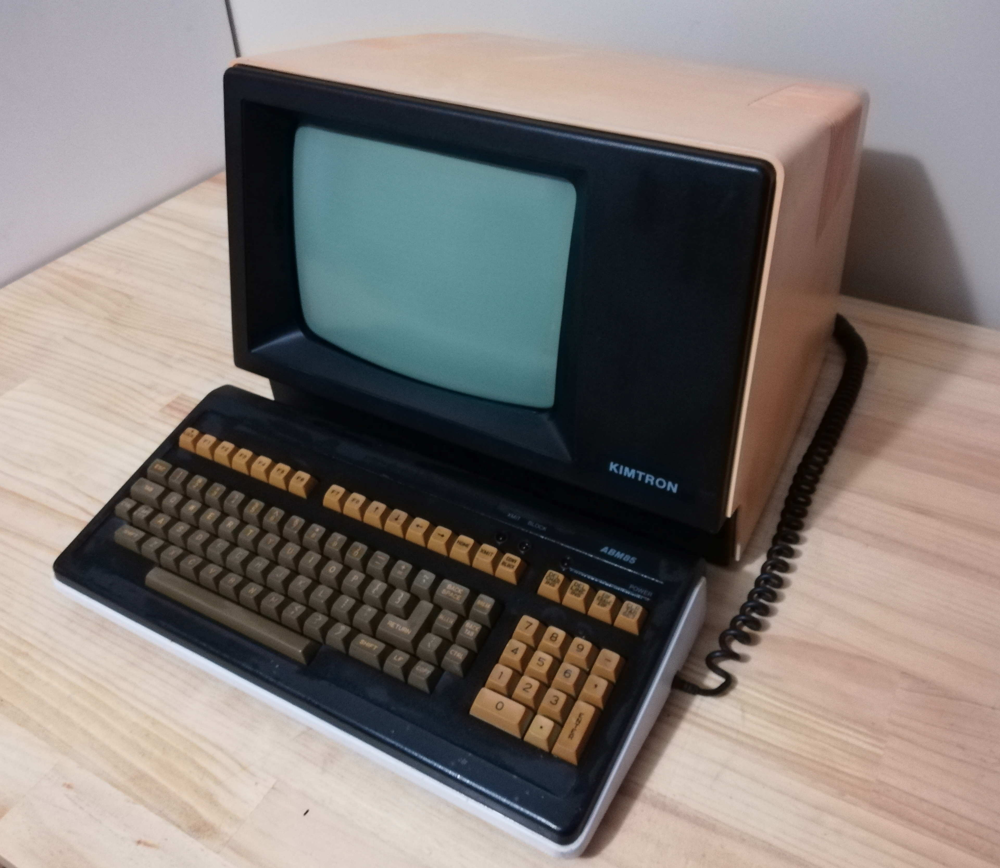

# Kimtron ABM-85 #

This repository contains some notes and incomplete schematics for the Kimtron ABM-85 terminal.

I own two Kimtron ABM-85 terminals both of witch have faults, in this repository I share the notes I have made while trying to get them working.

ROM images can be found at [bitsavers.org](https://bitsavers.org/pdf/kimtron/Kimtron_ABM-85/advertisement/) and in the repo.

 

## Notes ##

* Memory is not required for the screen to initialize
* UART is not required for the screen to initialize
* Edge connector can be unscrewed can passed out the front for easy testing
* DO NOT solder to the board while plugged in but off, caps hold a charge and sort to the iron
* Keyboard will be beep regardless of the logic board functioning at all
* The CRT will not display anything if there is no video signal.

### System 1 - Fresh out of storage, worked for 30min then failed ###
* CRT chip 8275 had died
* U15 74LS08 had an internal short between inputs
* CRT was working then failed when board failed, likely connected

### System 2 - Fresh out of storage, system did not work at all ###
* CRT chip 8275 had died
* Character ROM damaged
* 8085 dead
* One UART dead
* Some/all RAM dead
* 8155 dead, pin 7 stuck a 3v
* CRT is working but unstable

### Observation and Thoughts ###
Originally when I tested both of these terminals both had good power supplies, and good CRTs but only on of the logic boards worked. Both CRTs were unstable, the image had a tendency to lose sink and scroll. The terminal with a good logic board I left running for about 15-30 minutes, when I came back to it the screen had gone blank. Doing some testing the logic board had died, so had the CRT.

Both U15 (74LS08) and the 8275 had died, as well as the CRT. I suspect that some component in the CRT driver board has failed and killed both boards. As the CRT wars functioning previously I'm inclined to believe a capacitor develop a short. My next steps will be to recap both CRT drive board and repair any damage.

## Replacement Capacitors ##

https://docs.google.com/spreadsheets/d/1czg9hMJ3bNXz6wbedZvZkCWXic-MMVokBJp4r8-iu80/edit?usp=sharing